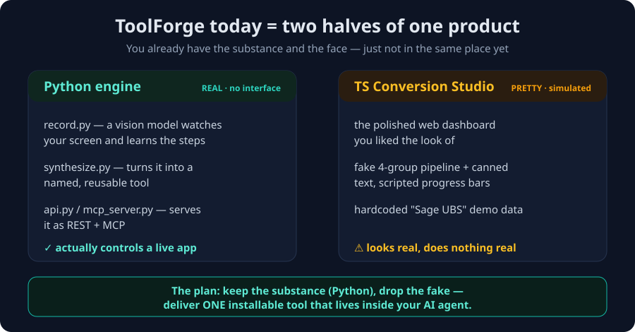
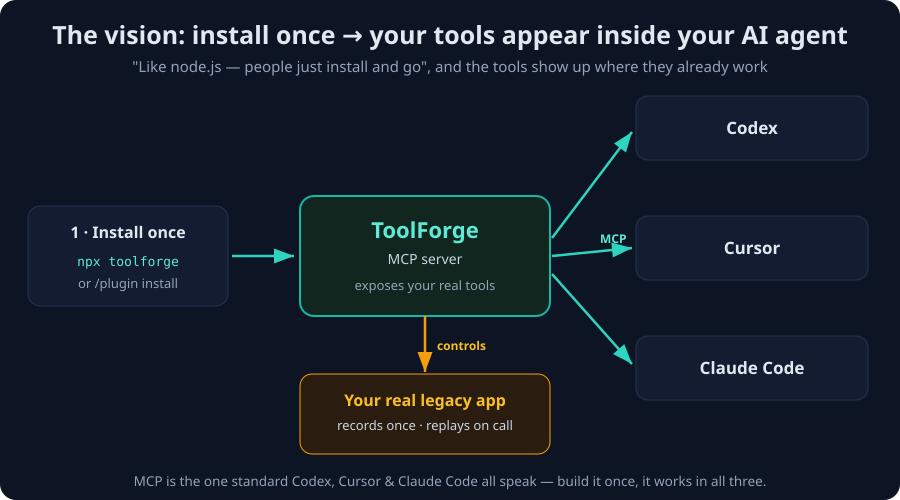
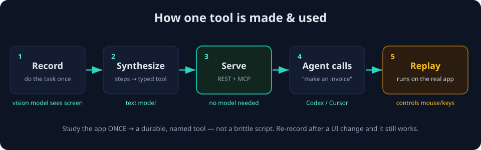

# ToolForge — Vision & Decisions (working notes)

> **What this file is:** a plain-language record of what ToolForge is *trying to be*, what we
> actually have today, and the few choices still left to make. Written so you can re-read it,
> change your mind, and point at the pictures. Nothing here is final — it's a thinking aid.
>
> *(The pictures are SVG files in `docs/diagrams/`. If they don't show in your viewer, each one
> also has a plain-text version right below it, and you can open the `.svg` in any web browser.)*

---

## 1. The one-line vision (in your words)

> **"I want it to be like how node.js works — people just install and go — and the tools show up
> in the same interface as Cursor or Codex."**

Unpacked, that means two things:

1. **Frictionless install.** One command, no fuss. Add it like you'd add a package.
2. **It lives inside the AI agent you already use** — Codex, Cursor, or Claude Code — *not* a
   separate website you have to open. Once installed, ToolForge's tools just *appear* there and
   the AI can call them.

The technology that makes #2 possible is **MCP** (see the glossary). MCP is the shared "plug" that
Codex, Cursor, and Claude Code all accept. Build one MCP server → it works in all three.

---

## 2. Where we are today: two halves of one product



<details><summary>Plain-text version of the picture above</summary>

```
ToolForge today = two halves of one product

┌─────────────────────────────────────┐   ┌─────────────────────────────────────┐
│  PYTHON ENGINE      REAL · no UI     │   │  TS CONVERSION STUDIO  PRETTY·fake  │
│                                      │   │                                      │
│  record.py    – vision model watches │   │  the polished web dashboard          │
│                 your screen          │   │  you liked the look of               │
│  synthesize.py– makes a named tool   │   │  fake 4-group pipeline + canned text │
│  api.py /                            │   │  scripted progress bars              │
│  mcp_server.py– serves REST + MCP    │   │  hardcoded "Sage UBS" demo data      │
│                                      │   │                                      │
│  ✅ actually controls a live app     │   │  ⚠ looks real, does nothing real     │
└─────────────────────────────────────┘   └─────────────────────────────────────┘

The plan: keep the substance (Python), drop the fake — deliver ONE installable
tool that lives inside your AI agent.
```
</details>

You have **substance with no face** (the Python engine) and a **face with no substance** (the
TypeScript dashboard). That single sentence is the whole situation.

| | **Python engine** | **TS Conversion Studio** |
|---|---|---|
| What it is | The real ToolForge engine | A polished web dashboard |
| Does it actually work? | **Yes** — drives a real app | No — it's a simulation |
| Lives inside Codex/Cursor? | **Yes** (it's an MCP server / plugin) | No (separate website) |
| Hardcoded demo to remove | `mcp_server.py` exposes only **one fixed tool** | The whole pipeline + fake "Sage UBS" data |
| Needs to run | OpenAI key + the target app open on screen | Nothing (because it's fake) |

**Takeaway:** your vision points at the **Python / MCP side**. The pretty dashboard is the wrong
*shape* for "lives inside Cursor/Codex" — so it gets set aside (we can reuse its visuals later if
useful).

---

## 3. What we're building toward



<details><summary>Plain-text version</summary>

```
                                            ┌────────────┐
                                       ┌──► │   Codex    │
  ┌────────────┐     ┌────────────┐    │    └────────────┘
  │ Install    │ ──► │ ToolForge  │ ───┼──► ┌────────────┐
  │ once       │     │ MCP server │    │    │   Cursor   │
  │ npx ...    │     │            │    │    └────────────┘
  └────────────┘     └─────┬──────┘    │    ┌────────────┐
                           │ controls  └──► │ Claude Code│
                           ▼                └────────────┘
                  ┌──────────────────┐
                  │ Your real app    │   (records once · replays on call)
                  └──────────────────┘

MCP is the one standard all three speak — build it once, it works in all three.
```
</details>

**The product flow becomes:**

```
install ToolForge → it appears as tools in Codex / Cursor / Claude Code → the agent calls them → they run for real
```

---

## 4. How a single tool gets made and used



<details><summary>Plain-text version</summary>

```
[1 Record] ─► [2 Synthesize] ─► [3 Serve] ─► [4 Agent calls] ─► [5 Replay on real app]
 do it once     steps→tool       REST+MCP      "make invoice"      runs on the app
 vision model   text model       no model      Codex/Cursor        controls mouse/keys

Study the app ONCE → a durable, named tool (not a brittle script).
```
</details>

You teach it a workflow **one time** (e.g. "create an invoice"), it becomes a permanent named
tool, and from then on any AI agent can call it — and ToolForge re-does the real clicks on the real
app. That's the "no-API desktop app, called by an AI agent" headline from your spec.

---

## 5. What "remove all the hardcoded demo" means, concretely

The things that are *fake / hardcoded* today and would be deleted or made real:

- [ ] **`mcp_server.py` only offers one fixed tool** (`create_invoice`). → Make it **dynamic**:
      automatically expose every real tool in `tools/*.tool.json` (the REST `api.py` already does
      this — the MCP side just needs to match).
- [ ] **TS dashboard's fake "Sage UBS" app** + canned spec text + scripted progress bars + the
      hardcoded 11-endpoint generated API over made-up data. → Set the dashboard aside (it doesn't
      fit "inside your agent").
- [ ] **Demo-mode being the default.** → If we keep any LLM step, it should use your real key
      (OpenAI `gpt-4o`) and real input, not canned strings.

What is **already real and stays**: `record.py`, `synthesize.py`, `executor.py`, `api.py`, and the
MCP/plugin packaging.

---

## 6. Decisions

> **DECIDED (2026-06-26):** ToolForge is a **plugin / MCP server** for **Codex *and* Claude Code**
> (the Composio-style *shape*, depth (a) — not a hosted platform yet). The plugin **serves & runs**
> your recorded tools and exposes them dynamically; **recording a new tool stays a local CLI step**
> (`record.py` → `synthesize.py`). The server needs **no OpenAI key** to run.
> → Install guide: [`INSTALL-plugin.md`](INSTALL-plugin.md).

Remaining (smaller) choices, for reference:

**A. Primary interface — where should it show up first?**
- [ ] Codex (you're in the Codex hackathon)  · [ ] Cursor · [ ] Claude Code · [ ] all three
- *Note:* it's currently wired for Claude Code; pointing it at Codex/Cursor is a small config
  change. MCP means we can support all three with little extra work.

**B. Inside that interface, do people just *use* tools, or also *create* them?**
- [ ] **Use only** — the agent calls tools you (the builder) recorded ahead of time. *(Simpler,
      safer, easier to demo.)*
- [ ] **Create too** — from inside the agent you can say "watch me do this once" and it records +
      makes a new tool on the spot. *(More powerful, more work, more moving parts.)*

**C. Install flavor — Node or Python?**
- [ ] **`npx toolforge`** (Node, matches your "like node.js" instinct). The real screen-recording
      is Python today, so a Node front would still call into Python under the hood.
- [ ] **`pip` / plugin install** (Python — the engine is already there, least new work).
- *Reframed by the [Composio comparison](ToolForge-vs-Composio.md): the real question under C is
  **single local tool now → Composio-style catalog later**, not just the install command.*

---

## 7. A recommended path (my suggestion, not a decision)

A safe, honest order that gets to "installable + real + inside your agent" without over-reaching:

1. **Make the real engine genuinely dynamic** — fix `mcp_server.py` so it serves *all* recorded
   tools, not just `create_invoice`. (Small change, removes the biggest "hardcoded" smell.)
2. **Record one real tool end-to-end** on an app you choose (even Notepad/Calculator) so we have a
   genuine, non-fake demo of the whole loop.
3. **Make install one command** for your chosen interface (A) and flavor (C).
4. *(Optional, later)* add **"create a tool from inside the agent"** (B) and/or revive the
   dashboard's visuals as an optional control panel.

> This keeps everything **real** at every step and gives you a working "install → it's in my agent
> → it does a real thing" story quickly.

---

## 8. Glossary (so the words are clear)

- **MCP (Model Context Protocol)** — an open standard for giving an AI agent extra tools. If you
  run an "MCP server", agents like Codex/Cursor/Claude Code can discover and call its tools. This
  is *the* mechanism behind "my tools show up inside the agent."
- **Codex** — OpenAI's AI coding agent (the hackathon you're in). Supports MCP servers.
- **Cursor** — an AI code editor. Supports MCP servers.
- **Claude Code** — Anthropic's AI coding agent. Supports MCP servers + plugins.
- **Plugin** — a packaged bundle (config + an MCP server) an agent can install in one step.
- **`record.py`** — watches your screen with a vision model and logs the steps to do a task.
- **`synthesize.py`** — turns those raw steps into a clean, named, parameterized **tool**.
- **`executor.py`** — replays a tool's steps on the live app, filling in the parameters.
- **REST API** — call a tool over HTTP with a key. **MCP server** — call the same tool from an AI agent.

---

## 9. Where things live

```
C:\Users\yapho\CodexHackathon\toolforge\
├─ record.py · synthesize.py · executor.py · api.py · mcp_server.py   ← the REAL engine (Python)
├─ .mcp.json · .claude-plugin\                                        ← plugin packaging
├─ HOW-TO-USE.md                                                      ← the engine's own run guide
├─ client\ · server\ · shared\                                        ← the TS dashboard (pretty, set aside)
└─ docs\
   ├─ ToolForge-Vision.md   ← this file
   └─ diagrams\  current-state.svg · target-vision.svg · product-flow.svg
```

---

*Last updated from our chat on 2026-06-26. Next step: answer the three questions in §6 and I'll make it real.*
