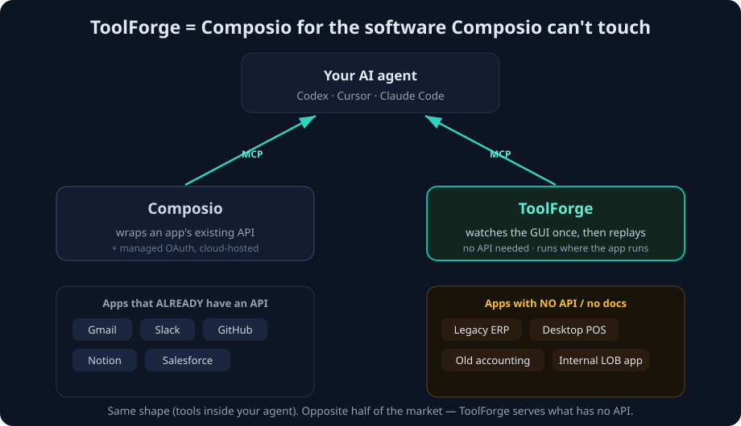

# ToolForge vs Composio — the positioning

> **What this file is:** the "is it like Composio?" question, written down. Composio turned out to
> be a much sharper mental model than "node.js" for the *shape* of ToolForge — and the comparison
> reveals exactly why ToolForge has a reason to exist. Companion to
> [`ToolForge-Vision.md`](ToolForge-Vision.md).

---

## The one-liner

> ### ToolForge = **Composio for the software Composio can't touch.**
> Composio connects the apps that **already have an API** (Gmail, Slack, GitHub, Notion…).
> ToolForge makes tools for the **desktop / legacy apps that never will** — by watching the GUI
> once instead of calling an API.

That's not a weaker Composio. It's the half of the market Composio — and Zapier, and every iPaaS —
**structurally cannot serve**, which is exactly the gap the [spec](../ToolForge-Spec.md) calls out:
*middleware needs an existing API; ToolForge works when there is none.*

---

## The picture



<details><summary>Plain-text version</summary>

```
                    ┌───────────────────────────────┐
                    │        Your AI agent          │
                    │  Codex · Cursor · Claude Code  │
                    └───────────────────────────────┘
                       ▲  MCP                ▲  MCP
                       │                     │
              ┌────────────────┐    ┌────────────────────┐
              │   Composio     │    │     ToolForge      │
              │ wraps existing │    │ watches the GUI    │
              │ APIs (+ OAuth) │    │ once, then replays │
              └────────────────┘    └────────────────────┘
                       ▲                     ▲
              Apps that ALREADY      Apps with NO API /
              have an API:           no docs:
              Gmail, Slack,          Legacy ERP, Desktop POS,
              GitHub, Notion,        Old accounting,
              Salesforce             Internal LOB app

   Same shape (tools inside your agent). Opposite half of the market.
```
</details>

---

## Same shape, opposite half of the market

| | **Composio** | **ToolForge** |
|---|---|---|
| Works on… | apps that **already have an API** | apps with **no API, no docs** (legacy desktop, old ERP/POS) |
| How a tool is made | wraps the app's **existing REST API** | **watches you do it once** on the GUI, then replays |
| "Auth" | managed OAuth | it just operates the app **as you**, on your machine |
| Where it runs | cloud, multi-tenant | wherever the app runs (**local**, today) |
| Distribution | SDK + MCP server into your agent | MCP server / plugin into your agent |
| Reliability | high (real APIs) | trickier (driving a GUI) — the price of reaching no-API software |
| Catalog | hundreds of pre-built SaaS integrations | tools **you record** for your own legacy apps |

**What's the same (and worth copying):** the *shape*. A tool layer that plugs into Codex / Cursor /
Claude Code over MCP, frictionless to install. That is exactly the "install → tools appear in my
agent" vision.

**What's different (and is the whole moat):** Composio assumes an API exists. ToolForge's entire
premise is the apps where it **doesn't** — so we create the tool by demonstration (vision + replay),
not by wrapping an endpoint.

---

## How *Composio-shaped* do we want it? (this reframes Decision C)

There are two depths of "be like Composio":

- **(a) The shape only** — frictionless install; your recorded tools show up in your agent via MCP;
  maybe a small **registry** of the tools you've made. → Achievable now; this is essentially where
  the vision doc was already heading, just framed better.
- **(b) The full platform** — a browsable catalog, managed connections, multi-user / cloud,
  "anyone can add a tool." → That's a real company (and the [business plan](../ToolForge-Spec.md)),
  not a weekend build.

> **Recommendation:** for the hackathon, build **(a)** and let it *imply* (b) — ship the local
> engine + one-command MCP install, and present it as *"the first node of a Composio-for-legacy-
> apps."* The pitch lands either way, and nothing you build gets thrown away.
>
> This means **Decision C** in the vision doc is less "Node vs Python install" and more
> **"single local tool now → Composio-style catalog later."** The install flavor is a detail; the
> catalog-vs-single-tool axis is the real strategic choice.

---

## The honest trade-off (say it before a judge does)

Driving a GUI is inherently more brittle than calling an API — that's the cost of serving the apps
nobody else can reach. Composio doesn't have this problem because it only does apps with APIs. So
ToolForge trades some reliability for **reach into software that is otherwise impossible to
automate**. The mitigation is the same one in the spec: scope to one clean, revenue-critical
workflow, and make replay *self-healing* (re-look at the screen each run) as the V2 wedge.

---

*Captured from our chat on 2026-06-26. See [`ToolForge-Vision.md`](ToolForge-Vision.md) for the
full picture and the open decisions.*
